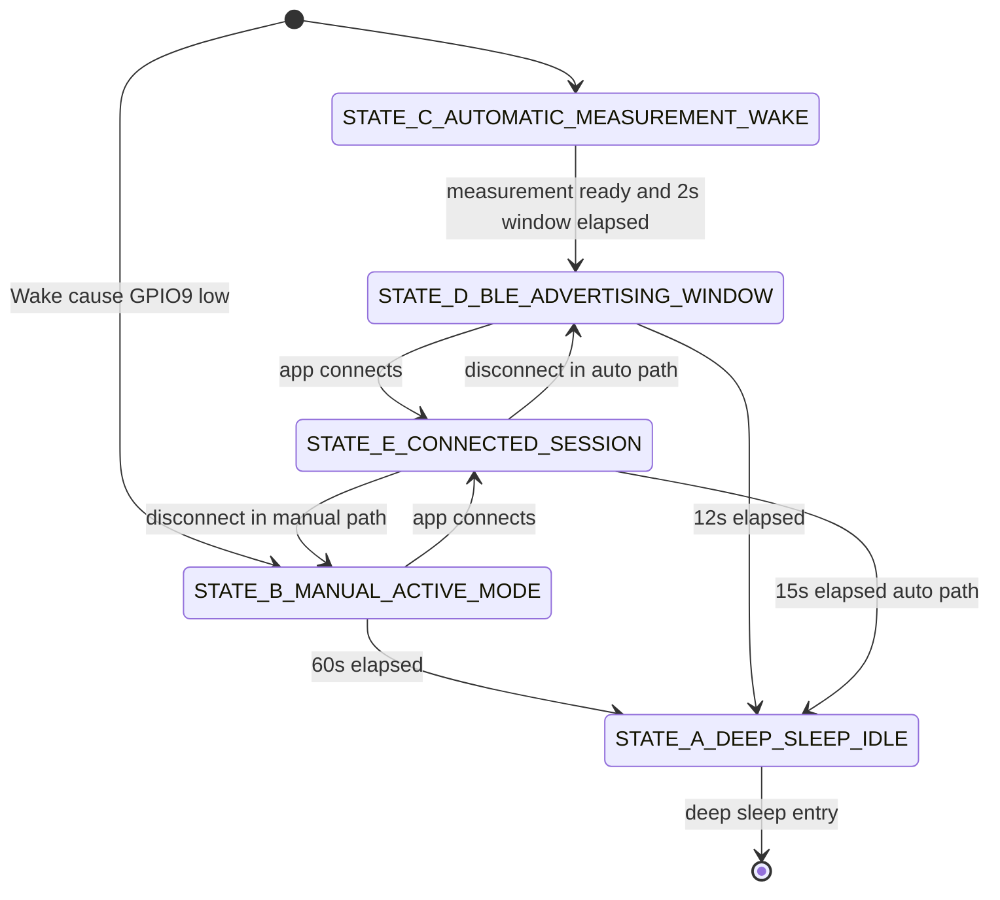

# HemePulse Full Code Walkthrough

## Update Note (April 2026)

Current firmware runtime has been migrated to always-awake mode:

- deep-sleep behavior is removed from active code,
- sleep-test entrypoint (`src/sleep_test_main.cpp`) is removed,
- sleep-test PlatformIO environment (`lolin_c3_mini_sleep_test`) is removed,
- periodic measurement cadence is now `kReadingIntervalMs = 20000`.

Authoritative runtime truth for current code:

- active telemetry path is compact packet UUID `...1009` (+ control `...1007`, baseline `...1008`),
- pulse-check mode is RED-only (`GPIO1`) and continues until explicit stop/disconnect,
- app-side BPM is computed from corrected RED valleys, not IR peaks,
- exact constants must be taken from `include/app_config.h` and `hb_monitor_app/lib/state/app_state.dart`.

Any legacy deep-sleep state-machine sections below are historical reference only.

> [!TIP]
> **New to the project?** Read the [Beginner's Data Pipeline Guide](./BEGINNERS_DATA_PIPELINE_GUIDE.md) first to understand how data flows from the ESP32 to the Flutter app, how BPM is extracted, and how you can tune the Hemoglobin equations!

## 1. Purpose and Reading Strategy

This document is a deep technical walkthrough of the HemePulse codebase across firmware and mobile app layers. It is intentionally long and explicit so that:

1. A beginner can trace data from GPIO toggles to app warnings.
2. An intermediate developer can safely edit thresholds and timing.
3. An advanced developer can reason about signal quality, trend reliability, and power behavior.

This walkthrough explains:

- Why each file exists.
- How each class and function behaves.
- What each key constant means.
- Which formulas are physical, which are empirical, and which are placeholders.
- How BLE payload fields are built and consumed.
- Why this system is trend-based and not a direct hemoglobin lab meter.

### Scientific Scope Boundary (Critical)

HemePulse utilizes reflective red/IR optical trends to estimate Hemoglobin (g/dL) via a custom native Dart decision tree regression model (`HbPredictor`). 

While it provides direct concentration output, absolute clinical claims require controlled calibration against clinical reference datasets. The app includes fine-tuning capabilities to adjust these values against actual ground truth testing.

Use this system as a prototype signal intelligence and trend warning tool, not as a clinical diagnostic replacement.

### What To Check In Code

- Confirm scientific scope text in app UI and docs does not claim absolute Hb.
- Confirm warning logic uses baseline drift, not direct concentration conversion.
- Confirm confidence and motion checks gate warning escalation.

---

## 2. End-to-End Architecture

### 2.1 Functional Role Split

#### ESP32 firmware role

The ESP32 firmware is a low-power sensor node. It does:

- LED pulse timing (ambient -> red -> dark -> IR cycle).
- ADC sampling and ambient subtraction.
- Lightweight smoothing and quality heuristics.
- Baseline capture and summary persistence.
- BLE packet publishing.
- Sleep/wake orchestration.

It does **not** do heavy trend charting or long-history analytics.

#### Flutter app role

The Flutter app is the analytics and UX brain. It does:

- BLE discovery, connect, notifications, command writes.
- Packet decoding and local buffering.
- BPM estimation and motion likelihood checks.
- Session trend comparison and warning presentation.
- Persistent app-side session history.

### 2.2 Data and Control Flow

### 2.3 Device State Machine

Firmware states are explicit in `src/main.cpp`:

- `STATE_A_DEEP_SLEEP_IDLE`
- `STATE_B_MANUAL_ACTIVE_MODE`
- `STATE_C_AUTOMATIC_MEASUREMENT_WAKE`
- `STATE_D_BLE_ADVERTISING_WINDOW`
- `STATE_E_CONNECTED_SESSION`

### What To Check In Code

- Confirm state transitions are all in `appLoop()` switch.
- Confirm GPIO9 wake path and timer wake are both configured before deep sleep.
- Confirm app computes long-term trend while firmware stays lightweight.

---

## 3. Repository and Folder Breakdown

## 3.1 Top-level folders

- `include/`: firmware headers, types, interfaces, and configuration constants.
- `src/`: active firmware source files.
- `hb_monitor_app/lib/`: Flutter app logic, models, services, UI.
- `hb_monitor_app/android/`: Android manifest and platform settings.
- `.vscode/`: recommended tool extensions.
- `platformio.ini`: PlatformIO build environments.

## 3.2 Active firmware source set

- `src/main.cpp`
- `src/scheduler.cpp`
- `src/hardware_io.cpp`
- `src/ble_transport.cpp`
- `src/calibration_store.cpp`
- `src/sleep_test_main.cpp`

## 3.3 Header notes

There are headers for archived modules:

- `include/signal_processing.h`
- `include/pulse_detector.h`
- `include/quality_score.h`
- `include/risk_engine.h`

These describe older or alternate architecture pieces, but corresponding `.cpp` files are currently removed from `src/` and are not part of the active runtime path.

### What To Check In Code

- Confirm `build_src_filter` in `platformio.ini` selects intended source files.
- Confirm no stale headers are accidentally reactivated without implementation.
- Confirm `src/README.md` reflects current runtime modules.

---

## 4. Build Configuration Walkthrough

## 4.1 `platformio.ini`

### Why this file exists

This file defines firmware build environments and source selection.

### Environments

1. `[env:lolin_c3_mini]`
   - Main firmware build.
   - Excludes `sleep_test_main.cpp`.
   - Includes NimBLE dependency.

2. `[env:lolin_c3_mini_sleep_test]`
   - Sleep validation firmware.
   - Compiles only sleep test entrypoint.

### Important fields

- `platform = espressif32`
- `board = lolin_c3_mini`
- `framework = arduino`
- `monitor_speed = 115200`
- `build_flags` include USB CDC settings for serial usability.

### Side effects

- Main and sleep test are independently buildable and flashable.
- Wrong environment selection can look like missing functionality (for example no BLE if sleep test firmware is flashed).

### What To Check In Code

- Ensure you flash `lolin_c3_mini` for normal operation.
- Ensure you flash `lolin_c3_mini_sleep_test` only for sleep validation.
- Verify serial monitor baud is 115200.

---

## 5. Firmware Constants and Data Types

## 5.1 `include/app_config.h`

### Why this file exists

Centralized constant definition. This prevents hidden magic numbers across modules and makes tuning reproducible.

### Constant-by-constant explanation

#### GPIO and ADC mapping

- `kRedLedPin = 1`
- `kIrLedPin = 2`
- `kAdcPin = 0`

These are hardware mapping constants. If they are wrong, all downstream logic becomes invalid.

- `kAdcResolutionBits = 12`
- `kAdcReferenceMv = 3300.0`
- `kAdcFullScale = 4095.0`

These map ADC counts to voltage using:

$V_{mV} = raw * (kAdcReferenceMv / kAdcFullScale)$

#### Timing constants (measurement cycle)

- `kMeasurementCyclePeriodUs = 20000` (50 Hz)
- `kLedSettleUs = 1500`
- `kDarkGapUs = 1000`

`kLedSettleUs` and `kDarkGapUs` are empirically tuned timing values balancing settling quality and cycle speed.

#### Legacy window constants

- `kSampleHistoryBufferSlots`
- `kAcDcWindowSamples`
- `kPeakHistorySlots`
- `kRatioConsistencyWindow`

These are still declared because legacy headers reference them. Current active runtime only uses a subset directly.

#### BPM and peak related constants (legacy but meaningful)

- `kMinBpm`, `kMaxBpm`
- `kMinPeakSpacingMs`
- `kPulseWindowMs`
- `kPeakThresholdScale`
- `kPeakThresholdFloor`

These represent common physiological and detection guardrails; currently app-side BPM estimation has its own thresholds.

#### Confidence and motion constants

- `kConfidencePoor = 35`
- `kConfidenceFair = 55`
- `kConfidenceGood = 75`
- `kMinConfidenceForBaseline = 65`

- `kEmaAlpha = 0.18`
- `kMinIrSignal = 20.0`
- `kMinRedSignal = 12.0`
- `kMotionRatioJumpThreshold = 0.09`
- `kMotionSignalJumpThreshold = 0.28`

These are mainly empirical prototype tunings based on expected signal magnitude and motion artifact behavior.

#### Drift and warning thresholds

- `kStableDriftThreshold = 0.05`
- `kElevatedDriftThreshold = 0.09`
- `kHighDriftThreshold = 0.14`
- `kElevatedStreakThreshold = 4`
- `kHighStreakThreshold = 8`

Drift thresholds are relative:

$drift = |(ratio - baseline) / baseline|$

This is trend logic, not direct Hb concentration.

#### Baseline capture timing

- `kBaselineCaptureDurationMs = 60000`
- `kMinBaselineSamples = 200`
- `kBaselineCapturePaddingMs = 10000`

Duration and minimum sample count are empirical safeguards against unstable baseline acceptance.

#### Session and power constants

- `kSessionActiveMs = 25000` (legacy path)
- `kNoConnectionSleepMs = 8000` (legacy path)
- `kSleepIntervalMs = 20000`
- `kManualWakePin = 9`
- `kManualActiveWindowMs = 60000`
- `kAutoMeasurementWindowMs = 2000`
- `kBleAdvertisingWindowMs = 12000`
- `kConnectedSessionWindowMs = 15000`
- `kEnableDeepSleep = true`

#### BLE and debug

- `kBleNotifyIntervalMs = 20`
- `kBleDeviceName = "HemePulse-C3"`
- `kEnableSerialDebug = false`
- `kEnableSerialWaveform = true`
- `kWaveformPrintIntervalMs = 20`

### Theoretical vs empirical vs placeholder classification

1. Mostly theoretical or hardware-derived:
   - ADC full scale and reference mapping.
   - Sampling frequency arithmetic relation.

2. Empirical tuned values:
   - settle times, motion thresholds, drift thresholds, streak lengths.

3. Placeholders requiring bench calibration:
   - photodiode sensitivity, amplifier gain, baseline voltage assumptions.

### What To Check In Code

- When tuning, change only one constant group at a time.
- Keep a tuning log with old and new values plus test context.
- Rebuild and test after each single-group change.

---

## 5.2 `include/types.h`

### Why this file exists

Single source of truth for data structures exchanged across modules and BLE.

### Structs and enums

- `WarningState`: semantic warning classes.
- `CommandType`: app-to-device control actions.
- `RawCycleSample`: one acquisition cycle payload.
- `ProcessedMetrics`, `PulseMetrics`, `QualityMetrics`, `RiskMetrics`: legacy/extended model structs retained for compatibility and future expansion.
- `TelemetryPacket`: compact packet model for BLE transport.
- `SessionSummary`: persisted summary model.
- `CalibrationProfile`: calibration and baseline state.
- `BleCommand`: parsed command container.

### Side effects

This file shapes both binary packet encoding and parser assumptions. Any field order/type change affects compatibility.

### What To Check In Code

- Never change `TelemetryPacket` field order casually.
- If changed, update firmware payload builder and app parser together.
- Keep warning enum mapping consistent across firmware and app.

---

## 5.3 `include/ring_buffer.h`

### Why this file exists

Reusable fixed-capacity circular buffer used by archived processing modules and still useful for future extensions.

### Key operations

- `push(item)` inserts newest and overwrites oldest when full.
- `atOldest(index)` and `atNewest(indexFromNewest)` provide directional access.

### Side effects

Index misuse can silently return wrong temporal ordering, causing unstable signal algorithms.

### What To Check In Code

- Confirm index semantics before reusing in new DSP code.
- Validate buffer `size()` before multi-point operations.

---

## 6. Firmware Active Module Walkthrough

## 6.1 `include/hardware_io.h` and `src/hardware_io.cpp`

### Why this file exists

Encapsulates direct pin and ADC operations so logic code does not manipulate hardware registers directly.

### Functions

1. `begin()`
   - Input: none.
   - Output: none.
   - Side effects:
     - Configures LED pins as outputs.
     - Turns LEDs off.
     - Sets ADC resolution and attenuation.

2. `setLedState(bool redOn, bool irOn)`
   - Inputs: two booleans.
   - Side effects: drives GPIO output states.

3. `readAdcRaw() const`
   - Output: signed 16-bit raw ADC count.

4. `rawToMillivolts(int16_t raw) const`
   - Output: scaled voltage in mV using config constants.

### Interactions

Used by scheduler and indirectly by all higher signal logic.

### What To Check In Code

- Verify pin map matches real board wiring.
- Confirm ADC attenuation is appropriate for sensor output range.
- If clipping appears, inspect gain and bias before software changes.

---

## 6.2 `include/scheduler.h` and `src/scheduler.cpp`

### Why this file exists

Implements non-blocking temporal sequencing for ambient/red/ir sampling.

### State machine

- `kInit`
- `kAmbientSettle`
- `kRedSettle`
- `kDarkSettle`
- `kIrSettle`
- `kWaitNextCycle`

### Helper functions

- `elapsedUs(now,start,wait)` determines elapsed time without blocking.
- `correctSample(litRaw, ambientRaw)` applies ambient subtraction and clamps negative values to 0.

### Main functions

1. `begin(HardwareIO&, nowUs)`
   - Binds hardware interface.
   - Resets scheduler state and timing.

2. `update(nowUs, sampleOut)`
   - Returns `true` only once full cycle completes.
   - Transitions through LED and read phases.
   - Writes corrected sample to `sampleOut`.

3. `startNewCycle(nowUs)`
   - Clears current sample.
   - Starts ambient phase.

### Formula used

$corrected = max(litRaw - ambientRaw, 0)$

### Interactions

Called continuously by `main.cpp::processMeasurementCycle()`.

### What To Check In Code

- Confirm timing constants produce expected LED pulse width.
- Confirm ambient subtraction does not clamp almost all values to zero.
- Confirm one and only one complete sample appears per cycle.

---

## 6.3 `include/calibration_store.h` and `src/calibration_store.cpp`

### Why this file exists

Persists baseline and calibration placeholders in ESP32 NVS using `Preferences`.

### Storage namespace and keys

Namespace: `hbcal`

Key families:

- Calibration: schema, sensitivity, gain, voltage reference.
- Baseline: red avg, ir avg, ratio R, validity.
- Session counters: stable, suspicious, bad.
- Last session summary values.

### Main functions

1. `begin()`
   - Calls defaults and then NVS load.

2. Setter functions
   - `setPhotodiodeSensitivity`, `setAmplifierGain`, `setBaselineVoltage`.
   - Side effect: immediate save to NVS.

3. Baseline functions
   - `setTrustedBaseline`, `setUserBaseline`, `clearUserBaseline`.
   - Applies validity guard `ratio > 1e-6`.

4. Session functions
   - `setSessionCounters`, `saveLastSessionSummary`, `loadLastSessionSummary`.

5. Internal load/save
   - `loadDefaults()`: uses placeholder values.
   - `loadFromStorage()`: reads keys and fallback defaults.
   - `saveToStorage()` and `saveSessionSummaryToStorage()`.

### Placeholder warning

Values such as photodiode sensitivity and amplifier gain are currently placeholders unless hardware bench-calibrated.

### What To Check In Code

- After baseline capture, verify `baselineValid` persisted true.
- Verify NVS keys update after calibration edits.
- Validate session summary persistence across reboot.

---

## 6.4 `include/ble_transport.h` and `src/ble_transport.cpp`

### Why this file exists

Implements BLE GATT service setup, packet notifications, baseline notification, and command parsing.

### Characteristics

- Service: `4f9c0100-a1f2-4c31-98cb-1cce5caa1000`
- Control: `...1007` (read/write)
- Baseline: `...1008` (read/write/notify)
- Compact packet: `...1009` (read/notify)

### Packet contract guard

`kCompactPacketPayloadSize` is compile-time checked with `static_assert == 17`.

This avoids silent schema drift.

### Lifecycle functions

1. `begin(deviceName)`
   - Initializes NimBLE.
   - Creates server, service, characteristics.
   - Starts advertising.

2. `update(nowMs)`
   - Processes incoming command writes.

3. `shutdown()`
   - Stops advertising.
   - Deinitializes NimBLE.

### Data publish

`publish(packet, cycleComplete, force)`:

- Drops send if not connected.
- Enforces notify interval unless forced.
- Rebuilds flags with baseline bits.
- Packs payload in little-endian byte order.
- Calls notify on packet characteristic.

### Command parser

`handleControlCommand(text)` accepts:

- `SNAP`
- `BASE_START`
- `BASE_CLEAR`
- `BASE_SET=<float>`
- `CAL_PD=<float>`
- `CAL_GAIN=<float>`
- `CAL_VREF=<float>`

### What To Check In Code

- Verify command strings exactly match app writes.
- Verify 17-byte packet order matches parser expectation.
- Verify advertising restarts after disconnect.

---

## 6.5 `src/main.cpp` (Core Runtime)

This is the firmware orchestrator. Reading top-to-bottom mirrors execution flow.

### 6.5.1 Global state and structs

- Device state enum defines sleep/active/advertise/connected modes.
- Singleton instances:
  - `gHardware`, `gScheduler`, `gCalibrationStore`, `gBleTransport`.
- Runtime trackers for packet snapshot, timers, connection, and wake mode.
- `RealtimeState`, `BaselineCaptureState`, `SessionAccumulator` hold rolling process context.

### 6.5.2 Utility functions

1. `clampU8(int)`
   - clamps to `[0,100]` for confidence.

2. `quantizeSignal(float)`
   - clamps to signed 16-bit range before packet pack.

3. `safeRatio(red,ir)`
   - returns 0 if IR too small or ratio non-finite.

### 6.5.3 Motion and confidence heuristics

1. `isMotionLikely(sample, ratio)`
   - compares jumps in red, ir, and ratio vs previous averages.
   - thresholds from `app_config.h`.

2. `computeSimpleConfidence(...)`
   - starts at 100.
   - subtracts penalties for low signal, bad ratio, high ambient contamination, and motion.

Penalty model is empirical and additive.

### 6.5.4 Warning logic

`evaluateLocalWarning(ratio, confidence, motionLikely)`:

1. If no valid baseline, returns `kBaselineNeeded`.
2. If poor confidence or motion, returns `kLowSignal`.
3. Computes normalized absolute drift.
4. Uses streak counters to avoid one-sample overreaction.
5. Returns `kElevated`, `kHigh`, or `kNormal`.

### 6.5.5 Flag encoding

`makeFlags(...)` sets bits:

- `0x02` base validity marker used by current firmware logic.
- `0x04` low confidence.
- `0x08` elevated/high warning.
- `0x10` baseline valid.
- `0x20` baseline capture active.
- `0x40` motion likely.

### 6.5.6 Debug output helpers

- `printDebug(...)` throttled structured debug output.
- `printWaveform(...)` serial waveform print used for live inspection.

### 6.5.7 State transitions and accumulators

- `transitionTo(nextState, nowMs)` updates state and optional debug log.
- `resetSessionAccumulator(nowMs)` resets session counters and timing anchors.
- `shouldDelaySleepForBaseline(nowMs)` keeps device awake during baseline capture + padding.

### 6.5.8 Baseline capture flow

- `startBaselineCapture(nowMs)` initializes capture accumulation.
- `updateBaselineCapture(...)`:
  - accepts only confident valid ratio samples.
  - stops after duration.
  - rejects if sample count below minimum.
  - computes averaged baseline and stores it.

### 6.5.9 Session summary flow

- `updateSessionAccumulator(...)` updates per-sample aggregates.
- `saveSessionSummary(nowMs)` computes averaged metrics and risk flag.

Risk flag mapping:

- `2`: invalid session or mostly bad signal.
- `1`: suspicious fraction dominates.
- `0`: stable.

### 6.5.10 Deep sleep entry

`enterDeepSleep(nowMs)`:

1. Debounces repeated calls with `gSleepRequested`.
2. Saves session summary.
3. Turns LEDs off and shuts down BLE.
4. Prints sleep debug line if serial mode active.
5. If deep sleep disabled, simulates reset path.
6. Enables timer wake (`kSleepIntervalMs`).
7. Enables GPIO wake on manual pin low when supported.
8. Calls `esp_deep_sleep_start()`.

### 6.5.11 Measurement processing

`processMeasurementCycle(nowUs)`:

1. Pulls one full sample from scheduler when ready.
2. Initializes or updates EMA red/ir averages:

$avg = avg + alpha * (new - avg)$

3. Computes ratio, motion, and confidence.
4. Updates baseline capture state.
5. Generates warning.
6. Builds `TelemetryPacket`.
7. Publishes BLE packet.
8. Updates session accumulator.
9. Emits waveform/debug output.

### 6.5.12 BLE command handler

`handleBleCommand(command)` dispatches to:

- snapshot publish
- baseline capture start
- baseline set/clear
- calibration placeholder setters

### 6.5.13 Setup

`appSetup()` does:

- optional serial init.
- manual wake pin pull-up config.
- hardware/scheduler/calibration/ble initialization.
- baseline state sync to BLE.
- wake cause inspection.
- initial state selection manual vs auto.

### 6.5.14 Main loop

`appLoop()` does:

1. BLE update and connection edge detection.
2. command queue draining.
3. measurement cycle processing in active states.
4. baseline delay guard.
5. state-machine switch with timing-based sleep transitions.

### What To Check In Code

- Verify only one location controls sleep transition timing.
- Verify `gAutoMeasurementReady` is set before advertising window transition.
- Verify command handler updates both storage and BLE baseline state.

---

## 6.6 `src/sleep_test_main.cpp`

### Why this file exists

Isolated low-risk sleep validation firmware.

### Behavior

- Initializes LED pins to off.
- Logs wake cause text and numeric value.
- Enables timer wake for 20 seconds.
- Immediately enters deep sleep.

### Side effects

No BLE and no measurement logic here; this is purposely minimal.

### What To Check In Code

- Use this build to validate wake cycle independently from BLE.
- Verify wake cause changes when using GPIO wake.

---

## 7. Archived / Interface-Only Header Walkthrough

These headers are still present and should be documented so a beginner does not assume they are active.

## 7.1 `include/signal_processing.h`

### Intent

Defines a `SignalProcessor` class for explicit AC/DC and bandpass extraction.

### Current status

Implementation file is removed from active `src`. This is currently a design reference interface.

## 7.2 `include/pulse_detector.h`

### Intent

Defines `PulseDetector` with peak history and BPM/stability computation.

### Current status

Not compiled in current runtime path.

## 7.3 `include/quality_score.h`

### Intent

Defines `QualityScorer` and consistency scoring based on ratio history.

### Current status

Interface exists but runtime currently uses simpler confidence in `main.cpp` and richer app-side logic.

## 7.4 `include/risk_engine.h`

### Intent

Defines `HemoglobinRiskEngine` with baseline capture and drift model.

### Current status

Core concepts are implemented directly in `main.cpp`; this header reflects modularized architecture option.

### What To Check In Code

- Do not assume headers imply active behavior.
- Confirm compiled source modules in `src/` before debugging behavior.
- If reactivating these modules, add matching `.cpp` and integration tests.

---

## 8. Flutter App Module Walkthrough

## 8.1 `hb_monitor_app/lib/main.dart`

### Why this file exists

Application entrypoint and root navigation shell.

### Key behavior

- Initializes `HemePulseAppState` with `ChangeNotifierProvider`.
- Uses `IndexedStack` to keep scanner/dashboard/calibration screens alive.
- Bottom navigation provides mode switching.

### Side effects

`initialize()` is called immediately on state creation, starting subscriptions and loading stored data.

### What To Check In Code

- Ensure provider is initialized once.
- Ensure state disposal path is reachable on app shutdown.

---

## 8.2 `lib/config/ble_config.dart`

### Why this file exists

Single UUID map used by app BLE service and parser routing.

### Side effects

Any UUID mismatch causes silent feature breakage (for example no packet processing while connected).

### What To Check In Code

- Keep UUIDs synchronized with firmware `ble_transport.cpp`.
- When adding characteristic fields, update both sides and parser.

---

## 8.3 `lib/services/payload_parser.dart`

### Why this file exists

Decodes little-endian BLE payload bytes into strongly typed Dart objects.

### Main parsing logic

`parseSensorPacket(bytes)`:

1. Checks minimum length 17.
2. Reads fields at fixed offsets.
3. Validates ratio finite and confidence in [0,100].
4. Maps warning byte to enum.

### Side effects

Invalid packet returns `null`, preventing bad data from contaminating downstream trend logic.

### What To Check In Code

- Verify offsets match firmware pack order.
- Verify app still receives baseline notify payload of length 5.

---

## 8.4 `lib/services/ble_service.dart`

### Why this file exists

Encapsulates FlutterBluePlus scanning, connection lifecycle, notify subscription, and command writes.

### Core operations

1. `startScan()`
   - listens to scan results.
   - filters devices by prefix.

2. `connect(device)`
   - disconnects previous.
   - connects and discovers services.
   - caches characteristics by UUID.
   - enables notify subscriptions.

3. `disconnect()`
   - cancels subscriptions.
   - disconnects device safely.

4. command methods
   - `requestSnapshot()`, `startBaselineCapture()`, `clearBaseline()`.

### Side effects

Wrong notify set leads to partial data updates. Control write errors surface as exceptions.

### What To Check In Code

- Ensure packet and baseline notify subscriptions exist.
- Verify control characteristic write capability.
- Confirm `deviceNamePrefix` filter still matches firmware name.

---

## 8.5 `lib/services/storage_service.dart`

### Why this file exists

Persists app-level calibration profile and session history in shared preferences.

### Functions

- `loadCalibrationProfile()` with safe fallback.
- `saveCalibrationProfile(profile)`.
- `loadSessionHistory()` with validation.
- `saveSessionHistory(sessions)`.

### Side effects

Corrupt JSON is safely ignored and replaced with defaults.

### What To Check In Code

- Verify serialization fields after model edits.
- Verify session history growth cap remains controlled by app state.

---

## 8.6 `lib/models` files

## `vital_snapshot.dart`

Defines per-sample runtime data and convenience flags:

- beat detected flag from bitmask.
- baseline availability and capture flags from bitmask.

## `session_summary.dart`

Defines persisted session-level aggregate values and warning state.

## `calibration_profile.dart`

Defines app-side calibration placeholders and baseline state.

### What To Check In Code

- Confirm `warning` enum index map remains stable.
- Confirm baseline validity semantics match firmware.

---

## 8.7 `lib/state/app_state.dart` (App analytics core)

This is the largest app logic module.

### Responsibilities

- BLE subscription coordination.
- data buffering and sample pipelines.
- BPM and motion estimation.
- confidence and warning adaptation.
- session finalization and persistence.
- calibration command and storage bridging.

### Top-level public methods

- `initialize()`
- `startScan()`
- `requestPermissions()`
- `connectToScanResult()`
- `disconnect()`
- `requestSnapshot()`
- `startBaselineCapture()`
- `clearBaseline()`
- `saveCalibration()`

### Packet update pipeline

Inside `_onBleUpdate()` for packet UUID:

1. parse packet.
2. derive ratio fallback if needed.
3. append raw series arrays.
4. estimate bpm.
5. estimate motion.
6. estimate confidence.
7. estimate warning.
8. create `VitalSnapshot` and append trend/session arrays.
9. update alerts.

### BPM estimation details (`_estimateBpm`)

Algorithm steps:

1. Use recent tail of IR series.
2. Build simple detrended signal by subtracting 5-point moving average.
3. Compute dynamic threshold:

$threshold = mean + max(2.0, stddev * 0.45)$

4. Pick local maxima above threshold.
5. Enforce min peak spacing 320 ms.
6. Keep intervals 300 to 1500 ms.
7. Convert average interval to BPM:

$BPM = round(60000 / avgIntervalMs)$

8. Reject BPM outside 40 to 190.

### Motion estimation (`_isMotionLikely`)

Uses recent differences in red, ir, and ratio.

- `irNorm > 0.22` or `redNorm > 0.22` or `ratioNorm > 0.07` => motion likely.

### Confidence estimation (`_estimateConfidence`)

Starts from packet confidence and applies penalties for:

- no BPM,
- low IR magnitude,
- low red magnitude,
- low recent span,
- motion.

### Warning estimation (`_estimateWarning`)

1. no baseline => baseline needed.
2. low confidence or motion => low signal.
3. compute drift against baseline.
4. track consecutive suspicious counts.
5. high warning when drift severe and repeated.
6. elevated warning when medium drift repeats.

### Session trend reinforcement (`_hasRepeatedSessionDrift`)

Looks at recent sessions and checks repeated drift with acceptable confidence and low motion.

### Session finalize (`_finalizeSession`)

On disconnect, if enough samples exist:

- computes averaged red/ir/ratio/confidence,
- computes session bpm average where available,
- stores summary in persistent history.

### What To Check In Code

- Verify app-side BPM does not run on empty/short buffers.
- Verify motion filter and warning thresholds remain aligned with firmware expectations.
- Verify session save occurs on disconnect transitions.

---

## 8.8 UI files

## `ui/screens/scan_screen.dart`

- Presents scan button, devices list, connect/disconnect controls.
- Displays connection or permission error text.

## `ui/screens/dashboard_screen.dart`

- Shows key metrics cards (BPM, ratio, confidence, warning).
- Shows IR trend chart.
- Shows session trend comparison and mode chips.

## `ui/screens/pulse_check_screen.dart`

- Exposes baseline capture and snapshot actions.

## `ui/screens/hemoglobin_status_screen.dart`

- Shows baseline, current ratio, drift percentage, recent sessions.
- Explicitly states trend indicator scope.

## `ui/screens/calibration_screen.dart`

- Allows editing and saving calibration placeholders and user baseline.

## `ui/widgets/trend_chart.dart`

- Draws custom IR waveform chart from app trend list.

### What To Check In Code

- Ensure warning label text and scientific scope remain accurate.
- Verify chart still renders if series length is small.
- Verify calibration save sends control commands when connected.

---

## 9. BLE Characteristics and Payload Contract

## 9.1 Characteristic summary

- `...1007` control: app writes command strings.
- `...1008` baseline payload notify/write.
- `...1009` compact packet notify/read.

Additional UUIDs (`...1001` to `...1006`) are subscribed by app for compatibility but primary runtime data path is compact packet `...1009`.

## 9.2 Compact packet (`17 bytes`) field map

Byte layout (little-endian):

1. bytes 0-3: `timestampMs` (uint32)
2. bytes 4-5: `ambientRaw` (int16)
3. bytes 6-7: `redCorrected` (int16)
4. bytes 8-9: `irCorrected` (int16)
5. bytes 10-13: `ratioR` (float32)
6. byte 14: `confidence` (uint8)
7. byte 15: `warning` (uint8)
8. byte 16: `flags` (uint8)

## 9.3 Baseline payload (`5 bytes`)

- bytes 0-3: baseline `float32`
- byte 4: valid flag (0/1)

### What To Check In Code

- If app receives malformed packets, validate byte count first.
- If warning mapping appears wrong, verify enum integer values.
- If baseline not visible, inspect both notification and parser length checks.

---

## 10. PPG and Signal Logic Explanation

## 10.1 Ambient subtraction

Ambient light contributes to ADC readings independently of pulsatile blood volume. Ambient subtraction helps isolate LED-induced optical response.

For each cycle:

$redCorrected = max(redRaw - ambientRaw, 0)$

$irCorrected = max(irRaw - ambientRaw, 0)$

## 10.2 LED pulsing rationale

The sequence ambient -> red -> dark -> IR ensures each LED contribution can be observed separately and compared against ambient.

## 10.3 AC and DC interpretation

In PPG:

- DC corresponds to slow/steady optical path components (tissue, average blood volume, bias).
- AC corresponds to pulsatile arterial modulation.

Current active runtime on ESP32 uses EMA and ratio heuristics directly. Archived interfaces (`signal_processing.h`) represent explicit AC/DC modularization for future or alternate build paths.

## 10.4 BPM extraction

Current BPM estimation is app-side using filtered IR peaks.

IR is generally preferred for pulse extraction due to stronger perfusion-related response in many setups.

## 10.5 Confidence logic

Confidence is a quality proxy, not ground truth certainty. It combines magnitude checks, ratio validity, ambient contamination cues, motion jumps, and app-side dynamic penalties.

### What To Check In Code

- Validate corrected signals are not always zero.
- Validate IR waveform has periodic structure before tuning thresholds.
- Do not trust BPM if confidence is consistently low.

---

## 11. Hemoglobin-Related Risk Logic (Trend-Based)

## 11.1 Why trend-based

Simple dual-wavelength reflective PPG cannot directly produce lab-grade absolute hemoglobin concentration without calibration against controlled reference datasets and robust tissue/path compensation.

Therefore this project uses:

- baseline-relative drift,
- repeated deviation detection,
- confidence/motion gating,
- session trend reinforcement.

## 11.2 Core drift formula

$drift = |(R - baselineR) / baselineR|$

Where $R$ is a relative optical ratio feature.

## 11.3 Consistent deviation vs random noise

The code avoids reacting to one bad sample by requiring:

- streak counts in firmware/app,
- confidence gates,
- motion suppression,
- repeated session checks in app.

### What To Check In Code

- Confirm baseline exists before interpreting drift.
- Confirm warnings do not escalate during known motion.
- Confirm repeated drift logic uses multiple sessions.

---

## 12. Power and Sleep Design

## 12.1 Deep sleep intent

Deep sleep minimizes battery draw during idle windows.

## 12.2 Wake sources

- periodic timer wake (`kSleepIntervalMs = 20000`),
- manual GPIO wake on pin 9 low when platform support macro is present.

## 12.3 Pre-sleep shutdown steps

Before `esp_deep_sleep_start()`:

- save session summary,
- LEDs forced off,
- BLE stack shutdown,
- optional serial log flush.

## 12.4 Interaction windows

- manual active: 60 s.
- auto measurement staging: 2 s.
- advertising window: 12 s.
- connected auto session: 15 s.

### What To Check In Code

- If board does not sleep, verify wake pin wiring and sleep macro support.
- If current draw is high, verify BLE is shut down before sleep.
- If wake cadence is wrong, verify timer unit conversion to microseconds.

---

## 13. Calibration Explanation and Placeholder Boundaries

## 13.1 Hardware parameter influence

### LED resistor and current

LED current is roughly:

$I_{LED} = (V_{supply} - V_f) / R$

This controls emitted optical power, not tissue absorption itself.

### Photodiode and TIA

Photodiode current roughly:

$I_{PD} = Responsivity * OpticalPower$

TIA output approximates:

$V_{out} = V_{bias} +/- I_{PD} * R_f$

`R_f` increases gain but can increase saturation risk and noise impact.

## 13.2 Placeholder vs measured values

`CalibrationStore` default values are placeholders unless measured:

- photodiode sensitivity A/W,
- amplifier gain V/A,
- baseline voltage reference.

These must be bench-verified for meaningful physical interpretation.

### What To Check In Code

- Do not assume placeholder calibration equals real hardware.
- Record actual resistor values, sensor model, and measured bias.
- Re-collect baseline after hardware changes.

---

## 14. Worked Examples

## 14.1 Example red LED current

Assume:

- supply = 3.3 V
- red LED $V_f = 1.9 V$
- resistor $R = 150 ohm$

Then:

$I = (3.3 - 1.9) / 150 = 0.0093 A = 9.3 mA$

Interpretation:

- Increasing current raises signal amplitude but also heat and power use.
- Too high current can saturate front-end chain.

## 14.2 Example IR LED current

Assume:

- IR LED $V_f = 1.25 V$
- same 3.3 V and 150 ohm resistor.

$I = (3.3 - 1.25) / 150 = 13.7 mA$

IR can be stronger at same resistor due to lower forward voltage.

## 14.3 Example photodiode + TIA interpretation

Assume:

- photodiode current variation $\Delta I = 200 nA$ from pulsatile change,
- feedback resistor $R_f = 330k ohm$.

Then approximate pulsatile voltage swing:

$\Delta V = \Delta I * R_f = 200e-9 * 330e3 = 0.066 V$

If this is too small relative to ADC noise floor, increase gain or optical signal carefully.

## 14.4 Example BPM from intervals

Suppose detected peak times:

- 1000 ms, 1820 ms, 2640 ms, 3460 ms

Intervals are all 820 ms.

$BPM = 60000 / 820 = 73.17$ => 73 BPM.

## 14.5 Example baseline drift

Suppose baseline ratio = 1.0200.

Current ratio = 1.1100.

$drift = |(1.1100 - 1.0200) / 1.0200| = 0.0882 = 8.82\%$

If this persists across confident low-motion samples, elevated warning is reasonable.

### What To Check In Code

- Recompute examples with your exact resistor and sensor values.
- Validate units in every formula before tuning thresholds.
- Keep all calculations in one engineering notebook per build.

---

## 15. Common Failure Modes and Root-Cause Guidance

## 15.1 LED too dim

Symptoms:

- very low corrected red/ir,
- confidence frequently low,
- flat trend chart.

Likely causes:

- high resistor value,
- wrong LED polarity,
- bad sensor placement.

## 15.2 ADC saturation

Symptoms:

- corrected channel pinned high,
- ratio unstable,
- warning swings.

Likely causes:

- excessive LED current,
- excessive TIA gain,
- wrong bias point.

## 15.3 Photodiode too noisy

Symptoms:

- jagged waveform,
- high motion flags even while still.

Likely causes:

- ambient leakage,
- grounding/layout issues,
- unstable contact pressure.

## 15.4 Wrong GPIO mapping

Symptoms:

- no waveform change with LED states,
- impossible readings.

Likely causes:

- mismatch between hardware wiring and `app_config.h` pins.

## 15.5 Deep sleep not entering

Symptoms:

- serial logs continue without sleep interval,
- current draw remains high.

Likely causes:

- sleep disabled,
- active baseline delay,
- missed state transition conditions.

## 15.6 BLE not advertising

Symptoms:

- app cannot discover device.

Likely causes:

- wrong firmware environment flashed,
- NimBLE init failure,
- device sleeping outside advertising window.

## 15.7 Motion noise

Symptoms:

- unstable BPM,
- confidence drops,
- warning oscillation.

Likely causes:

- user movement,
- loose sensor contact,
- cable vibration.

### What To Check In Code

- Reproduce each failure with controlled test steps.
- Confirm issue layer first: hardware, firmware, or app.
- Avoid threshold edits before raw-signal integrity check.

---

## 16. Module Interaction Matrix

| Module | Inputs | Outputs | Side Effects | Downstream Users |
|---|---|---|---|---|
| `hardware_io` | pin constants, ADC read request | raw ADC counts | GPIO writes | `scheduler` |
| `scheduler` | timing, hardware reads | `RawCycleSample` | LED state sequencing | `main` |
| `main` | samples, config, commands | packets, warnings, sleep transitions | BLE publish, NVS writes, deep sleep | app parser, app state |
| `ble_transport` | packet structs, commands | GATT notifications, command objects | NimBLE init/deinit | `main`, app BLE service |
| `calibration_store` | setters and summaries | profile values | NVS persistence | `main` |
| app `ble_service` | scan/connect user actions | notify streams | bluetooth operations | `app_state` |
| app `payload_parser` | packet bytes | typed sensor packet | drops malformed data | `app_state` |
| app `app_state` | notify stream | snapshots, warnings, sessions | local persistence | UI screens |
| app UI | state model | visuals and user actions | command triggers | BLE service/state |

### What To Check In Code

- Verify no hidden circular dependencies were introduced.
- Verify packet schema changes are updated in both firmware and app.
- Verify lifecycle cleanup (disconnect/subscription cancel/dispose).

---

## 17. Documentation Notes for Future Contributors

1. Keep this walkthrough updated whenever packet schema or state-machine timing changes.
2. If archived headers become active again, add explicit implementation links and tests.
3. Maintain the scientific scope boundary in all user-facing messaging.

### Final Code Review Checklist

- [ ] Firmware still avoids claiming direct hemoglobin concentration.
- [ ] BLE packet schema unchanged or versioned and documented.
- [ ] Sleep and wake timing constants documented and tested.
- [ ] App warning logic still baseline-relative and confidence-gated.
- [ ] Calibration placeholders clearly marked as non-measured defaults.
- [ ] At least one still-user and one motion-user validation run recorded.

---

## Appendix A: Quick Formulas Reference

- Ambient subtraction:
  - $S_{corr} = max(S_{lit} - S_{ambient}, 0)$
- EMA update:
  - $x_{ema,new} = x_{ema,old} + alpha * (x - x_{ema,old})$
- Ratio feature:
  - $R = red / ir$ (in active runtime path)
- Drift:
  - $drift = |(R - baseline) / baseline|$
- BPM:
  - $BPM = 60000 / intervalMs$
- LED current estimate:
  - $I = (V_{supply} - V_f) / R$
- TIA voltage contribution:
  - $V = I_{PD} * R_f$

## Appendix B: Practical Scope Reminder

- Resistors set current and transimpedance gain.
- They do not directly reveal tissue absorption values by themselves.
- Absolute hemoglobin requires calibration against clinical references.
- This project intentionally performs trend-based relative risk estimation.
